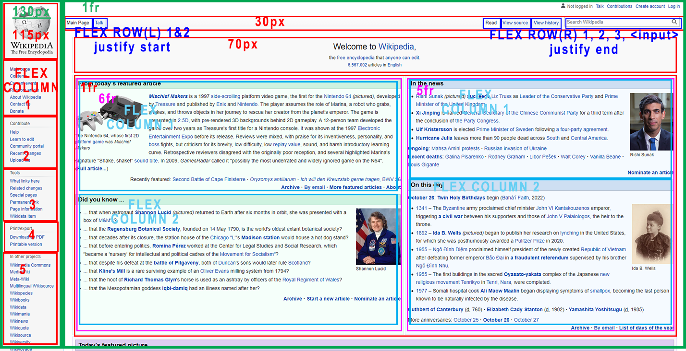

## README

-COLUMNS-

1. LEFT 130px
2. RIGHT 1fr

-LEFT COLUMN-

1. LOGO 115px
2. FLEX COLUMNS 1-5 (1fr)
   General 6 links
   Contribute 5 links
   Tools 6 links
   Print 2 links
   Other 12 links

-RIGHT COLUMN-

&Header&

1. %nav% 30px
2. welcome slogan 70px
 <h1>
 <h2>

%Nav%

1. Flex start
   Main Page | Talk
2. Flex end
   Read | View Source | View History | <input />

&MAIN& 1fr

1. ^collection left^ columnn 6fr
2. ^collection right^ column 5fr

^Collection left^

1. article flex column 1
 <h3>Title
 

2. article flex column 2
 <h3>Title
 

 ^Collection right^

3. article flex column 1
 <h3>Title
 

4. article flex column 2
 <h3>Title
 

